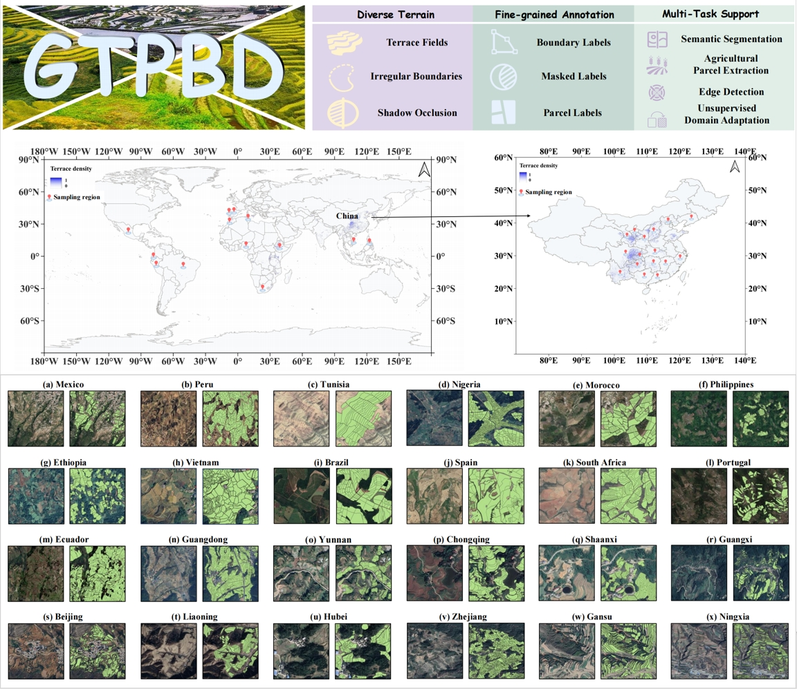
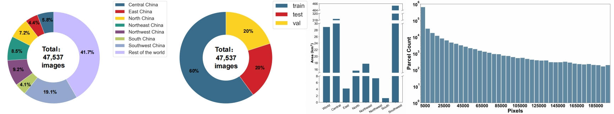

# GTPBD: Global Terraced Parcel and Boundary Dataset

# Abstract

GTPBD (Global Terraced Parcel and Boundary Dataset) is the first fine-grained benchmark dataset for agricultural parcel extraction in global terraced regions. Unlike previous datasets focused on regular, flat farmlands, GTPBD specifically addresses complex terrain types, providing rich annotations and multi-task evaluation protocols for semantic segmentation, edge detection, parcel extraction, and domain adaptation.

# Highlights

* **Global Scope**: 24,238 high-resolution images from China, Vietnam, Tunisia, Ethiopia, Mexico, Peru, and more.
* **Terraced Focus**: Over 200,000 annotated terraced parcels, including mountainous, shadow-occluded, and irregular field structures.
* **Multi-level Labels**:

  * **Parcel Mask Labels**
  * **Pixel-level Boundary Labels**
  * **Instance-level Parcel Labels**
* **Multi-Task Support**:

  * Semantic Segmentation
  * Edge Detection
  * Agricultural Parcel Extraction
  * Unsupervised Domain Adaptation (UDA)

# Dataset Structure

GTPBD(Each image is a 512x512 crop collected from 0.1m-1m resolution sources (Google Earth, GF-2))  
├──images/mask_labels/boundary_labels/parcel_labels  
│   ├── test

│   │   ├── Central China  
│   │   ├── East China  
│   │   ├── North China  
│   │   ├── Northeast China  
│   │   ├── Northwest China  
│   │   ├── Rest of the world  
│   │   ├── South China  
│   │   ├── Southwest China  

│   ├── train

│   │   ├── Central China  
│   │   ├── East China  
│   │   ├── North China  
│   │   ├── Northeast China  
│   │   ├── Northwest China  
│   │   ├── Rest of the world  
│   │   ├── South China  
│   │   ├── Southwest China  

│   ├── val

│   │   ├── Central China  
│   │   ├── East China  
│   │   ├── North China  
│   │   ├── Northeast China  
│   │   ├── Northwest China  
│   │   ├── Rest of the world  
│   │   ├── South China  
│   │   ├── Southwest China

# Statistics

* **Geographic Coverage**: 7 major zones in China + global transcontinental regions
* **Area Covered**: 593 km² of annotated terraces
* **Label Diversity**:

  * 3-level labels (mask, boundary, parcel)
  * Complex topologies (shared vs. non-shared field ridges)

# Tasks & Benchmarks

### 1. Semantic Segmentation

* **Models**: U-Net, DeepLabV3, PSPNet, SegFormer, Mask2Former, etc.
* **Metrics**: IoU, Pixel Accuracy, F1-score, Recall, Precision

### 2. Edge Detection

* **Models**: UEAD, MuGE, PiDiNet, REAUNet-Sober
* **Metrics**: ODS, OIS, AP

### 3. Agricultural Parcel Extraction

* **Models**: HBGNet, SEANet, REAUNet
* **Metrics**: OA, IoU, F1, plus object-level:

  * GOC (Over-Classification Error)
  * GUC (Under-Classification Error)
  * GTC (Total Classification Error)

### 4. Unsupervised Domain Adaptation (UDA)

* **Domains**: South (S), North (N), Global (G)
* **Transfers**: S → N, G → S, etc.
* **Methods**: Source Only, FDA, DAFormer, HRDA, PiPa

## Download

Hosted on Hugging Face: [GTPBD on Hugging Face](https://huggingface.co/datasets/wxqzzw/GTD)

```GTPBD_on_Hugging_Face
git clone https://huggingface.co/datasets/wxqzzw/GTD
```

Croissant metadata is available for NeurIPS submission validation.

# Contact & License

* Maintainer: Zhiwei Zhang ([HuggingFace Profile](https://huggingface.co/wxqzzw))
* License: [Apache 2.0](https://choosealicense.com/licenses/apache-2.0/)

# Acknowledgements

We thank all 50+ annotators and collaborators for their contributions to this large-scale terraced dataset effort.

For questions, feel free to raise an issue or contact the maintainers via GitHub.

‍
